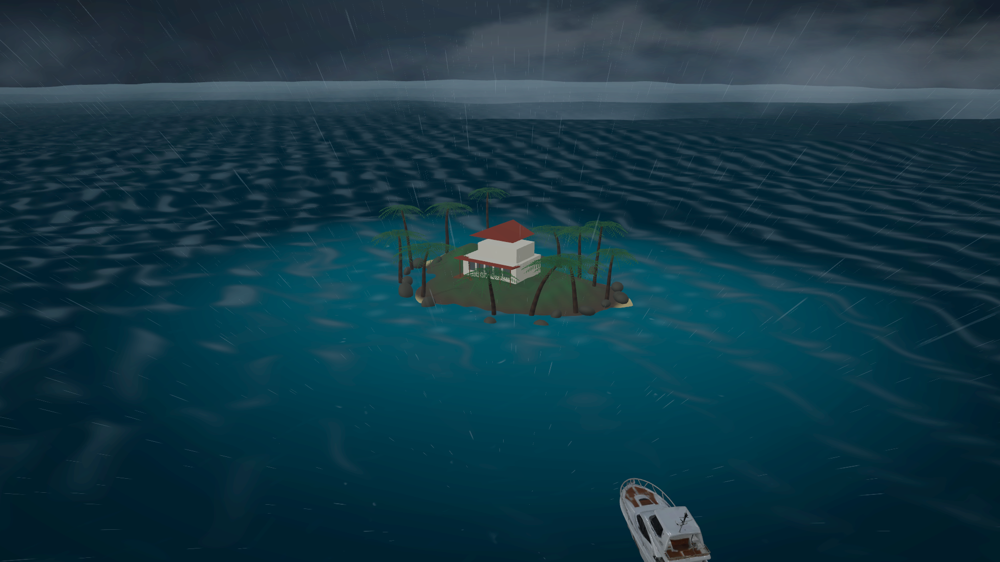

# Ocean Engine

一个基于 Three.js 的可驾驶热带海洋风暴场景。项目面向桌面浏览器，包含频谱海面、可操控游艇、岛屿与棕榈树、雨幕、闪电、雷声，以及会随天气变化的海况。

**在线体验：** [ocean-engine-one.vercel.app](https://ocean-engine-one.vercel.app)



## 功能概览

- **驾驶视角**：`W` 前进、`S` 后退、`A` 左转、`D` 右转；镜头自动跟随游艇。
- **天气系统**：按 `T` 在晴朗、降雨和暴风雨之间切换。暴风雨会增强海浪、雨势、云层、闪电反射和雷声。
- **海面模拟**：JONSWAP 派生的多级频谱波浪，渲染与 CPU 浮力查询使用同一组波场；包含泡沫、破碎反射和船尾尾流。
- **闪电与雷声**：独立的 TypeScript 闪电物理模块、程序化闪电通道、光照反射和基于距离的雷声调度。
- **岛屿场景**：GLB 格式的岛屿、碰撞体和棕榈树资源，带 LOD 和风力摆动；游艇在资源加载失败时有程序化几何回退。
- **性能自适应**：根据设备能力动态调整雨滴、云层、海面级联、次级闪电、尾流和像素比，适合无独立显卡的 Mac mini。

这是实时艺术化海洋模拟，不是完整的 CFD 流体求解器。CPU 浮力查询使用稳定的主导波分量，避免 GPU 回读造成卡顿。

## 本地运行

需要 Node.js 18+ 和支持 WebGL2 的浏览器。

```bash
npm install
npm start
```

然后打开 Vite 输出的本地地址。项目默认使用 WebGL2；页面会检测 WebGPU 能力，但当前渲染管线仍是 WebGL2。

## 操作说明

| 按键 | 作用 |
| --- | --- |
| `W` / `S` | 前进 / 后退 |
| `A` / `D` | 左转 / 右转 |
| `T` | 切换晴朗、降雨、暴风雨 |

如果浏览器暂停了音频，点击画面或按一次键即可恢复；即使 Web Audio 不可用，驾驶和画面仍会继续运行。

## 项目结构

```text
src/boat/                    游艇动力学、碰撞、控制和跟随镜头
src/ocean/                   波场、海况、频谱和 CPU 查询
src/render/                  海面材质、着色器和 WebGL2 渲染
src/visual/                  岛屿、棕榈树、游艇、尾流和材质
src/weather/                 天气、雨、云、闪电和雷声
src/weather/lightning-core/  与渲染器解耦的闪电物理核心
public/assets/models/        GLB 场景资源和 LOD 清单
tests/                       Vitest 单元测试
e2e/                         Playwright 冒烟、驾驶、视觉和性能测试
```

## 验证

```bash
npm test
npm run build
npx playwright install chromium
npm run test:e2e
```

macOS 的性能测试会选择 ANGLE Metal，在 1280×720 下分别记录晴朗、暴风雨和闪电状态的帧率与帧时间。

如需录制可复现的浏览器演示：

```bash
npm run dev -- --port 4174
npm run record:video
```

录制结果会写入 `output/visual-delivery/`；该目录被 `.gitignore` 排除，不会自动上传到仓库。

## 开源与致谢

闪电物理核心参考并移植自 [aipulsedaily/lightning-sim](https://github.com/aipulsedaily/lightning-sim)，遵循其 MIT 许可证。移植范围、版权和许可证说明见 [THIRD_PARTY_NOTICES.md](THIRD_PARTY_NOTICES.md)。

海岛海浪的视觉灵感来自 [Chetan 的 Three.js 海岛演示](https://x.com/chetanankola/status/2084402491073146987)。

## 安全说明

仓库只包含源代码、公开资源和测试文件，不需要 API key 或运行时密钥。请勿把 `.env`、访问令牌、私钥或本地部署凭据提交到仓库；Vercel 的本地项目元数据目录 `.vercel/` 已被忽略。

## 许可证

本项目的原创代码和配置按仓库中的许可证文件发布；第三方资源和代码以各自的许可证和致谢文件为准。
